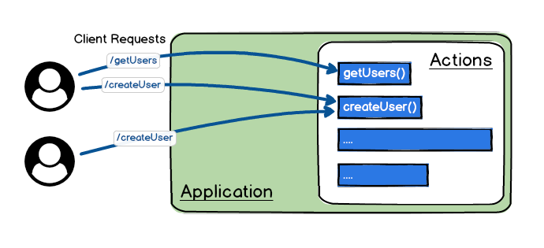

# Actions

A wind-waker `app` is all about `actions`.

It's a simple way to figure out how to build your `application`, 
only thinking in the `actions` you need, `wind-waker` will do the hard work for you.

All incoming requests will be mapped to the corresponding `action`.




An `action` is responsible to handle a request and send back a response to client.

## Creating an Action

To define an `action` you need to create a file using the `.action.ts` suffix.
For example let's create a `hello.action.ts` file.

```typescript title="hello.action.ts"
export const hello = (input) => {
  return `hello ${input.name}!`
}
```

`Wind Waker` will load and publish the hello action.

Visit it on `http://localhost:4000/hello?name=World`


:::tip Notice
1. The function's name will be used as the `action` name.
2. The action function first argument is the querystring name=World convert to javascript object input = {name: "Hello"}
:::


## Action Arguments

The action function can receive 2 arguments:
1. `input`
2. `context`

### Input

The `input` argument will take the value automatically from the querystring or payload.

You don't need to handle any logic, wind-waker will set the correct value in each case.

:::warning Important!
wind-waker discourage the meaning of REST HTTP verbs, to keep the concepts simple.

Each action can be access by using any HTTP verbs.
:::

Example:

```typescript title="user-list.action.ts"
export const userList = (input) => {
  // input will be {limit: 10, page: 1}
  return input;
}
```

Request via get:
```shell
curl -X GET http://localhost:4000/userList?limit=10&page=1 
```

Request via post will be the same:
```shell
curl -X POST http://localhost:4000/userList?limit=10&page=1 
```

:::tip Recomendation
Use in the client side just verbs:
1. `GET` for the queries
2. `POST` for the mutation operations


:::

Where the `input` value comes from?

The `querystring` will be picked for:
- `GET`
- `DELETE`

The `payload` will be picked for:
- `POST`
- `PUT`
- `PATCH`


### Context

The second argument will be the action context defined this way:

```typescript
interface Context {
  req: IncomingMessage;  // the http request data
  res: ServerResponse;   // the http response data
  rawBody: string;       // content received without any process
  url: URL;              // nodejs URL object for the current request
}
```

The context will be used to store useful resources for your applications. For example the logger instance will be injected to context if you use the $logger built-in pipe.

```typescript title="hello.action.ts"
import { $logger } from 'wind-waker';

export const hello = (input, ctx) => {
  ctx.log.info(`hello ${input.name}!`);
  
  return `hello ${input.name}!`
}

setPipes(hello, [$logger])
```

The $logger `Pipe` will set log property in the context (ctx) to the logger instance.

:::tip Congratulations!
Now you know how to create your actions.
:::

If you want to know more about pipes and define your own pipes go to next section.
