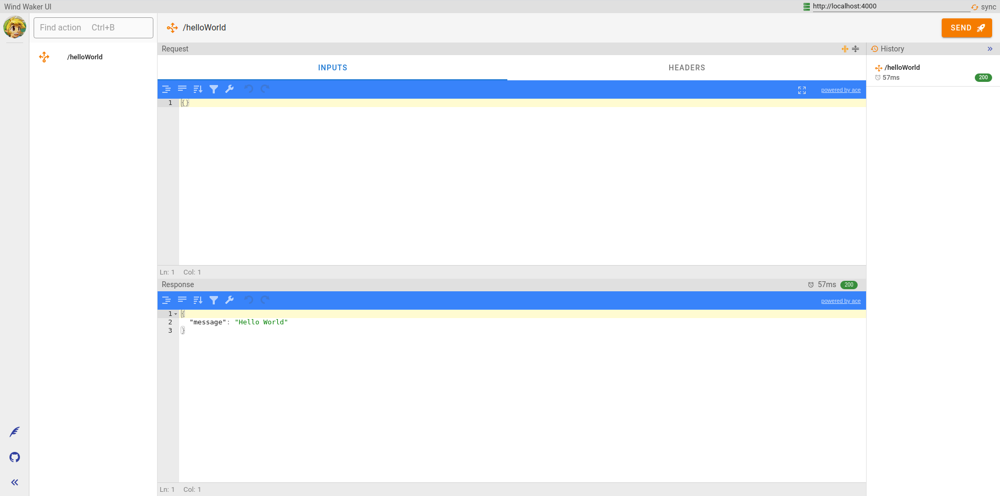

# Get Started


## Installation

Run the following command to execute the Wind Waker Command Line tool:

```shell
npx wind-waker-cli
```

## Usage

The wind-waker-cli create an app for you with these npm scripts:
- `dev`: Start your app in development mode.
- `dev:ui`: Start your app in development mode and launch the wind-waker-ui Tool.
- `build`: Transpile your app to javascript into the dist folder.
- `start`: Start your app from dist folder.

Use `dev:ui` if you want a client to test your app.
Your browser will be show this:


See more about the UI [here]
