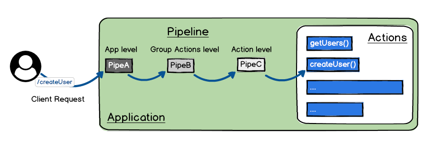

# Overview

Wind Waker is a nodejs server, very simple to use yet powerful with optimized performance.
It's easy to learn and used to build high quality Backend APIs.
It's implemented with Typescript.

You will implement [Actions](/guides/actions.md) to respond client requests

Wind-waker also provide a Pipeline layer before execute the actions,
where you can set useful Pipes to make your work easier, for example you can add:
- `cors` Pipe to configure and enable CORS in your app.
- `helm` Pipe to add security.
- `jwt` Pipe to handle authentication and authorization.

For more details visit the [Pipe section](/guides/pipes.md)

## Main concepts
- [Application](/guides/app.md)
- [Actions](/guides/actions.md)
- [Pipes](/guides/pipes.md)

You need to understand these 3 guides concepts, before start to use Wind Waker Framework.

## The [Application](/guides/app.md)

The [Application](/guides/app.md) is the core of a Wind Waker server, 
it will load all the configurations and `Actions` to create 
a Node.js server ready to receive incoming requests.

## The [Actions](/guides/actions.md)

An [Actions](/guides/actions.md) is a function defined by the user to handle an incoming request.

## The [Pipes](/guides/pipes.md)

A [Pipe](/guides/pipes.md) is a reusable function you can use to plugin logic. 
You can set `Pipes` at different levels: `Application`, Action Group or `Action`.
