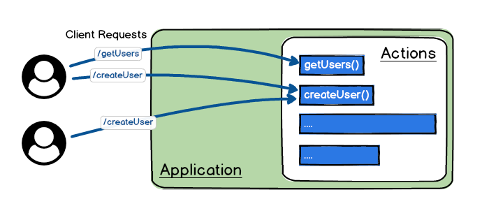
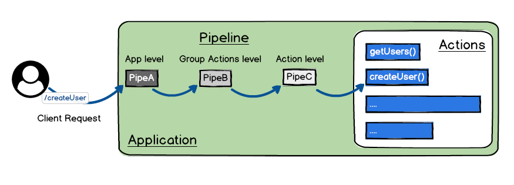

# Overview

Wind Waker is a nodejs server, very simple to use yet powerful with optimized performance.
It's easy to learn and used to build high quality Backend APIs.
It's implemented with Typescript.

You will implement [Actions](./basics/actions.md) to respond client requests



Wind-waker also provide a Pipeline layer before execute the actions,
where you can set useful Pipes to make your work easier, for example you can add:
- `cors` Pipe to configure and enable CORS in your app.
- `helm` Pipe to add security.
- `jwt` Pipe to handle authentication and authorization.



For more details visit the [Pipe section](./basics/pipes.md)

## Main concepts
- [Application](./basics/app.md)
- [Actions](./basics/actions.md)
- [Pipes](./basics/pipes.md)

You need to understand these 3 guides concepts, before start to use Wind Waker Framework.

## The [Application](./basics/app.md)

The Application is the core of a Wind Waker server, 
it will load all the configurations and `Actions` to create 
a Node.js server ready to receive incoming requests.

```typescript title="app.ts"
import { App } from 'wind-waker';

const app = new App();
app.start();
```


## The [Actions](./basics/actions.md)

An [action](./basics/actions) is a function defined by the user to handle an incoming request.

```typescript title="hello.action.ts"
export const hello = (input) => {
  return `hello ${input.name}!`
}
```

`Wind Waker` will publish the hello action.

Visit it on `http://localhost:4000/hello?name=World`

## The [Pipes](./basics/pipes.md)

A [Pipe](./basics/pipes.md) is a reusable function you can use to plugin logic. 
You can set `Pipes` to the entire app or to a single `Action`


```typescript title="app.ts"
import { App, $cors } from 'wind-waker';

const app = new App();
// enabling cors 
app.pipe($cors())
app.start();
```

```typescript title="hello.action.ts"
import {$logger} from 'wind-waker';

export const hello = (input) => {
  return `hello ${input.name}!`
}

// enabling logs just for the hello action.
setPipes(hello, $logger())
```
